# Tutorial-10
---
#### Nama: Naufal Ichsan
#### NPM: 2206082013
#### Kelas: Adpro A
---
### Refleksi
#### 2.1. Original code of broadcast chat.
#### Server
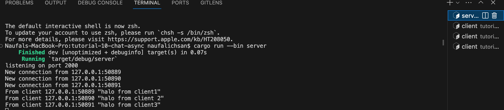
#### Client 1
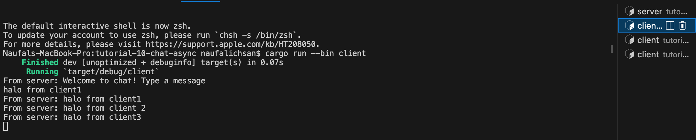
#### Client 2
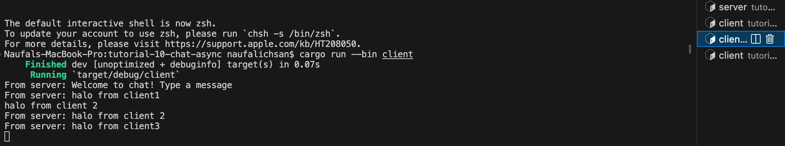
#### Client 3
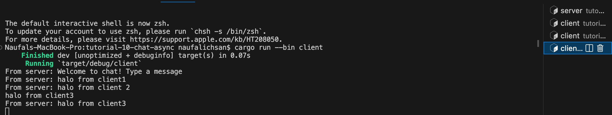

Setelah server dijalankan dan 3 client mengirimkan pesan, dari output di atas dapat terlihat bahwa setiap client dan juga server menerima siaran obrolan dari setiap client. Setiap kali seorang client mengetikkan pesan di baris perintah, string tersebut akan dikirim ke server dan server akan terus mengirimkannya ke semua client yang terhubung dengannya.

#### 2.2. Modifying the websocket port
Apabila port client dan server sama, maka aplikasi dapat berjalan dengan lancar
#### Client
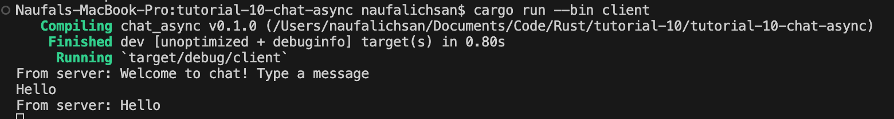

#### Server
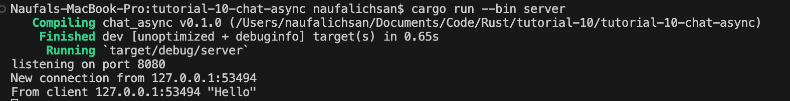

Namun, jika misalnya kita hanya mengubah salah satu port, misalnya port server menjadi 8080 dan port client tetap 2000, maka akan terjadi error pada client karena menurut client port tersebut tidak memiliki koneksi

#### Client
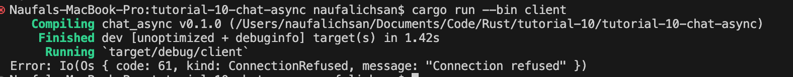

#### Server
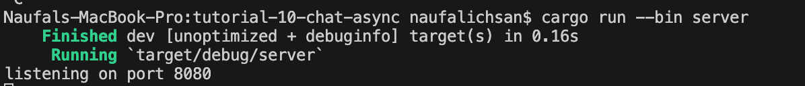

#### 2.3. Small changes. Add some information to client
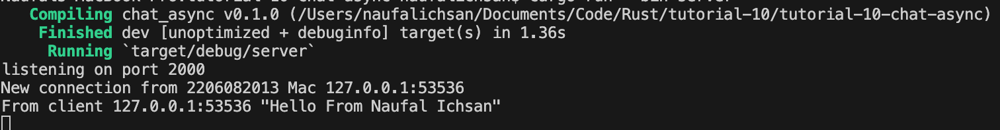
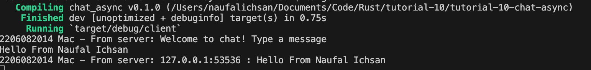
**server code changes**

**client code changes**
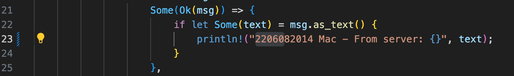
Perubahan tersebut dilakukan agar ketika bcast.tx ke semua client menyertakan alamat pengirim teks melalui variabel addr.
